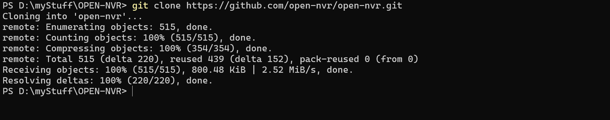
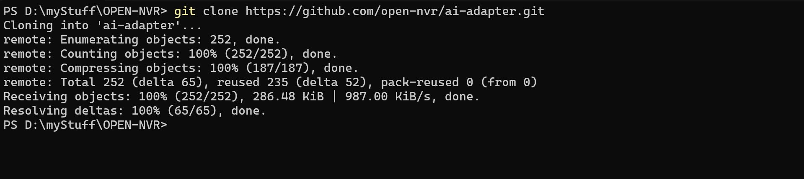
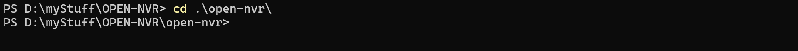

# 🛡️ OpenNVR
**AI-Powered, Security-First Video Surveillance Platform**

Bring AI to the Edge. Own Your Security. Deploy Anywhere.

## What you get

- **Live multi-camera NVR** — ONVIF / RTSP ingest, HLS playback, event recording via MediaMTX.
- **Pluggable AI pipeline** — person detection, face recognition, scene captioning out of the box; add your own via the [AI Adapter SDK](https://github.com/open-nvr/ai-adapter).
- **Self-hosted, privacy-first** — your footage never leaves your hardware unless *you* wire it up.
- **Cross-platform** — Windows, macOS, Linux (bridge or host networking).
- **One-command install** — interactive wizard generates secrets, clones optional components, and starts everything.

---

## 🐳 1. Docker Build & Deployment (Recommended)
This is the recommended approach for **Linux**, **macOS**, and **Windows** users. The install wizard wires the entire ecosystem together automatically.

### Prerequisites
- Git
- Docker Desktop (Windows/macOS) or Docker Engine + Compose v2 (Linux)

### Step-by-Step Build

1. **Clone the core OpenNVR repository**
   ```bash
   git clone https://github.com/open-nvr/open-nvr.git
   ```
   

2. **Clone the AI Adapter repository as a sibling**
   ```bash
   git clone https://github.com/open-nvr/ai-adapter.git
   ```
   

3. **Enter the NVR root directory**
   ```bash
   cd open-nvr
   ```
   

4. **Run the smart start script**

   **Linux / macOS:**
   ```bash
   chmod +x start.sh
   ./start.sh
   ```

   **Windows (PowerShell):**
   ```powershell
   .\start.ps1
   ```
   

   > **Initial Setup:** If it is your first time bringing the containers up, the interactive setup will block the sequence and engage with you in the terminal.

   

   On first run the wizard will:
   - check prerequisites (Docker, Compose, Git)
   - ask for recording storage path and initialization configs
   - check if the [ai-adapter](https://github.com/open-nvr/ai-adapter) repo is present
   - generate strong secrets and write `.env`
   - build images and start the stack

   Subsequent runs of `start.sh` / `start.ps1` just validate and start — no re-install.

   > Prefer doing it by hand? Copy `.env.example` → `.env`, fill in secrets (or run `./scripts/generate-secrets.sh -Write` / `.\scripts\generate-secrets.ps1 -Write`), then `docker compose up -d --build`.

## 🌐 2. Access the Web UI

Once the services are healthy, open your browser and navigate to `http://localhost:8000`. You will automatically be redirected to the **First-Time Setup** page to initialize your `admin` password securely before accessing the dashboard:


🎉 **Core Endpoints:**
- OpenNVR Web UI: `http://localhost:8000`
- OpenNVR API Docs: `http://localhost:8000/docs`
- MediaMTX: `http://localhost:8889`
- AI Adapter API (if enabled): `http://localhost:9100`

---

## 💻 2. Local Developer Setup (Without Docker)
For developers looking to run OpenNVR purely locally in an IDE utilizing local virtual environments.

### Prerequisites
- **Python 3.11+**
- **uv** (Python package manager - [install guide](https://docs.astral.sh/uv/getting-started/installation/))
- **Node.js 18+**
- **PostgreSQL 13+** (Running locally on your OS)
- **MediaMTX** (Download the binary for your OS from their GitHub releases)

### Preparation
1. **Clone Both Repositories side-by-side**
   ```bash
   git clone https://github.com/open-nvr/open-nvr.git
   git clone https://github.com/open-nvr/ai-adapter.git
   ```
2. **Setup your environment variables**
   ```bash
   cd open-nvr
   cp server/env.example server/.env
   # Edit server/.env to point to your local PostgreSQL username and password
   ```

### Running the Services (Requires 5 Terminals)
You must start the microservices independently.

**Terminal 1: PostgreSQL & OpenNVR Backend**
```bash
cd open-nvr/server
uv venv venv

# Activate venv (Linux: source venv/bin/activate | Windows: .\venv\Scripts\activate)
uv sync

# Migrate DB and Start
alembic upgrade head
python start.py
```

**Terminal 2: KAI-C (AI Orchestrator)**
```bash
cd open-nvr/kai-c
uv venv venv

# Activate venv (Linux: source venv/bin/activate | Windows: .\venv\Scripts\activate)
uv sync

# Start Connector
python start.py
```

**Terminal 3: React Frontend**
```bash
cd open-nvr/app
npm install
npm run dev
# Access frontend at http://localhost:5173
```

**Terminal 4: MediaMTX**
```bash
# Extract the binary you downloaded and run it using the local config file provided in our repo:
./mediamtx open-nvr/mediamtx.local.yml
```

**Terminal 5: AI Adapter (optional — only if you want AI detection)**
```bash
# Clone ai-adapter as a sibling directory to open-nvr:
#   parent/
#   ├── open-nvr/
#   └── ai-adapter/
git clone https://github.com/open-nvr/ai-adapter.git ../ai-adapter
cd ../ai-adapter
uv venv

# Activate venv (Linux/macOS: source .venv/bin/activate | Windows: .\.venv\Scripts\activate)
uv sync --extra all --extra cpu

# Download model weights
uv run python download_models.py

# Start Adapter
uv run uvicorn app.main:app --reload --port 9100
```

---

## 📖 Additional Documentation
- [User Manual](USER_MANUAL.md) - Using the Web Interface
- [Security Policy](SECURITY.md) - Core system limits and hardening
- [Contributing](CONTRIBUTING.md) - PR flow and coding standards

---

## ⚖️ License
This project is 100% open-source and licensed under the **GNU Affero General Public License v3.0 (AGPL v3)**. 
By strictly enforcing the AGPLv3, OpenNVR guarantees that any ecosystem modifications—even when utilized over an external network or distributed cloud service—must uniformly remain open-source. For full terms, please see the `LICENSE` file in the root directory.

> For enterprise commercial licensing exemptions, custom deployment support, or corporate sponsorships, please reach out directly: **[contact@cryptovoip.in](mailto:contact@cryptovoip.in)**
