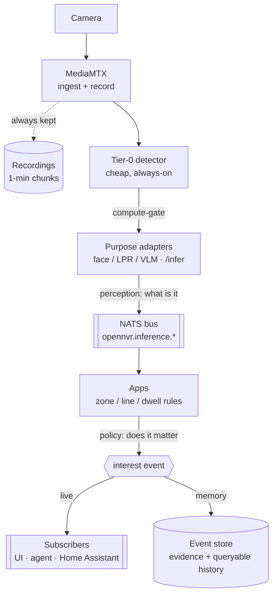

<div align="center">


# OpenNVR

### Build AI applications for your cameras.

**OpenNVR is open-source video infrastructure for people who want AI on their cameras without handing the video to anyone.** Connect ONVIF/RTSP cameras, record and stream, plug in *any* AI model, install ready-made apps or write your own — on hardware you own, offline if you like. It is also a complete NVR, so it works on day one and the AI is added on top.

*Cameras are everywhere. Almost none of them are yours.* — **Your cameras. Your infrastructure. Your AI.** No mandatory cloud, no vendor lock-in.

[](https://github.com/open-nvr/open-nvr/actions/workflows/ci.yml)
[](LICENSE)
[](https://www.python.org)
[](https://doi.org/10.5281/zenodo.22804254)
[](DISCORD_INVITE_URL)

### [▶ 90-second demo](docs/DEMO.md) · [⚡ Quick start](#get-it-running) · [🧩 Build an AI adapter](https://github.com/open-nvr/ai-adapter#write-your-own-adapter) · [📱 Build an app](docs/FIRST_DETECTOR.md) · [🏠 Home Assistant](docs/HOME_ASSISTANT_USER_GUIDE.md) · [🔒 Security](docs/SECURITY_ARCHITECTURE.md) · [💬 Discord](DISCORD_INVITE_URL)

<a href="https://opennvr.org/camera-agent">
  
</a>

</div>

---

## What you can build with it

```
IP camera ──▶ OpenNVR (record · stream · detect · remember) ──▶ AI adapter (YOLO · your model · a cloud model)
                                                                          │
                                                          event ──▶ app · webhook · Home Assistant · the agent
```

- **A doorbell that knows your family** and never phones home — face recognition on your box, names bound to visits, strangers alerted with a photo.
- **A gate that opens for allowed plates only** — plate reads audited end to end, the barrier driven by an app you can read.
- **"Did a blue car come by after nine?"** — answered by your own hardware, with the photos, from every visit it remembered.
- **Your cameras in Home Assistant** with nothing to install — every camera, zone and app as a device; switches, counts, plates, arming.
- **Cameras that can't be reached from the internet, and AI that can't leak.** The camera network is isolated from the analytics layer by architecture; camera credentials are encrypted at rest; video leaves the host only over RTSPS; apps reach the outside world only through an egress proxy on an allowlist you approve; and two default-deny gates keep every cloud route and non-local model off until you opt in. Every inference is audited with a correlation id from the alert to the model. **This is what most camera software gets wrong, and it is the part of OpenNVR nobody else ships** — [the security architecture](docs/SECURITY_ARCHITECTURE.md), control by control.

Everything an app needs — cameras, streams, recording, detections, an event store with evidence, alerts, auth, audit — is the platform's job. Yours is the rule. See the [app catalog](#applications-ship-on-top-of-it) for what ships, and [build your own in 15 minutes](docs/FIRST_DETECTOR.md).

---

## Get it running

Two commands. You need [Docker](https://docs.docker.com/get-docker/) — Desktop on Windows/macOS, Engine + Compose v2 on Linux — and nothing else. No account, no API key, no cloud anything.

```bash
git clone https://github.com/open-nvr/open-nvr.git && cd open-nvr
./start.sh          # Windows: .\start.ps1
```

That's the install. The launcher opens a short wizard where **every question has a working default in `[brackets]` — press Enter through all of them** and you get a running stack. It generates the secrets, pulls the images, starts everything, and prints your URL and a one-time setup token at the end.

> ⏳ **First run: 8–15 minutes**, almost all of it downloading container images (and a ~1 GB local model if you pick the camera agent). Every start after that is seconds.

Open the printed URL, accept the self-signed certificate once, paste the token, set a password, add a camera. Detection overlays appear within about 30 seconds.

**No camera to hand?** [OpenNVR Cam](https://play.google.com/store/apps/details?id=org.opennvr.cam) turns an Android phone into a real ONVIF camera that OpenNVR discovers like any other. Or let the camera agent use the webcam on the machine itself — no provisioning at all.

<details>
<summary><b>Running it again, stopping it, and other day-two commands</b></summary>

Run `./start.sh` (or `.\start.ps1`) any time — if it's already set up it asks whether to start as-is or reconfigure. To skip the question, give it a word:

| Situation | Command |
|---|---|
| Start now, no prompt | `./start.sh up` |
| Re-print the setup token | `./start.sh token` |
| Change settings or swap the example | `./start.sh reconfigure` |
| Your LAN IP changed (DHCP, moved boxes) | `./start.sh refresh-certs` *(Linux/macOS)* |
| Stop everything | `./start.sh down` |
| Tail live logs | `./start.sh logs` |
| Check container status | `./start.sh status` |
| Pick up new images after an upgrade | `docker compose pull && ./start.sh up` |

**Unattended or scripted installs** — skip the wizard entirely:

```bash
cp .env.example .env
./scripts/generate-secrets.sh --write    # or write your own values
./start.sh up
```

Bare `docker compose up -d` works too, but you lose the NIC topology auto-detect, the security posture banner, and the setup token being surfaced — you'd be grepping logs for it.

Retention, production hardening, and a reference for every compose file: [`DOCKER_QUICKSTART.md`](DOCKER_QUICKSTART.md).
</details>

## Add capabilities in one click

Once it's up, **App Catalog** in the sidebar lists thirteen installable applications — plate recognition, a face-recognising doorbell, intrusion zones, loitering, occupancy counting, line crossing, abandoned objects, package delivery, gate control, guard-scan compliance, natural-language footage search, alert routing, and a Home Assistant bridge. Search it, pick one, click **Install**, then choose which cameras it watches. No compose files, no YAML.

Each app declares what it needs before you install it — which cameras, which network hosts it may reach, whether it wants a licence key — and an administrator approves that, so an app cannot quietly acquire access it never asked for. Apps in the catalog are open source under the `open-nvr` organisation and built from source by CI.

Cameras get **jobs**, too. Assign camera 1 to plate recognition and cameras 2–3 to people counting on each camera's settings page; the capabilities point themselves at the right cameras while recording and streaming continue on all of them ([how assignments work](docs/CAMERA_ASSIGNMENTS.md)).

## Talk to your cameras

The camera-agent lets you *ask* your cameras questions — all on your hardware. **One command, from the repo root:**

```bash
examples/camera-agent/quickstart.sh          # voice: click Start and speak
examples/camera-agent/quickstart.sh --chat   # chat: type and read (lighter — no mic/speaker)
examples/camera-agent/quickstart.sh --down   # stop
```

Then open <http://localhost:9100/demo>. **No camera?** Click **"Use this machine's camera"** to run against your laptop webcam (or any USB/Pi/onboard device) with zero provisioning.

First boot pulls the small LLM (default `qwen2.5:1.5b`) and warms the adapters — give it a minute. A few knobs:

- **Low-RAM box** — `OLLAMA_MODEL=qwen2.5:0.5b examples/camera-agent/quickstart.sh`
- **Mac / Windows: run the LLM on the host** — Docker's VM has no GPU access on
  these platforms, so the bundled LLM container answers on plain CPU (minutes
  per turn on an M1). Set `OLLAMA_EXTERNAL_URL=http://host.docker.internal:11434`
  in `.env` (the installer offers this — and can install Ollama and pull the
  model for you): the agent uses host Ollama on the real GPU (Metal on Apple
  Silicon, seconds per turn) and the 3.2 GB ollama image is skipped entirely.
  Pair with `CAPTION_ADAPTER=ollamavlm` to run scene descriptions on the same
  host runtime.
- **Cloud / bring-your-own brain** — point it at any OpenAI-compatible endpoint; see [`config.cloud.yml`](examples/camera-agent/config.cloud.yml)
- **Drive Compose yourself** — `docker compose -f docker-compose.yml -f docker-compose.camera-agent.yml --profile camera-agent up -d` (or `--profile camera-agent-chat`)

Full details — model picks, hardware notes, how it works — in [`examples/camera-agent/README.md`](examples/camera-agent/README.md).

**What you can ask:**

| You say | What happens |
|---|---|
| *"What's at the back gate?"* | LLM calls BLIP for a scene caption of the live frame |
| *"Is anyone in the kitchen?"* | LLM calls YOLOv8 on the current frame |
| *"Did anyone walk past in the last ten minutes?"* | LLM queries the inference event ring on NATS |
| *"Who was at the door this morning?"* | LLM calls InsightFace against your enrolled face DB |
| *"Did a red truck come by the dock earlier?"* | LLM searches the remembered visits in the event store |

Under the hood: a local LLM (Ollama) doing OpenAI-style tool-calling over your live frames — or a cloud brain you bring. The LLM runtime is a dial, not a dependency: the bundled Ollama container (Linux default), an Ollama on the machine hosting Docker (`OLLAMA_EXTERNAL_URL` — the macOS/Windows default, where the host's GPU does the work), or any OpenAI-compatible endpoint. The default is the full hands-free voice loop (Pipecat · Silero VAD · Whisper STT · Piper TTS); `--chat` is the same agent, lighter, typed instead of spoken. No cloud and no API keys unless *you* choose a cloud model.

This is the first OpenNVR example where the cameras have agency, not just data.

## Why this exists

In 2016, a botnet called Mirai conscripted hundreds of thousands of IP cameras into the largest DDoS attack the internet had ever seen. In 2021, an attacker compromised cloud credentials at Verkada and took live feeds from around 150,000 cameras across hospitals, schools, prisons, and factories. Federal advisories continue to land against major vendors — Hikvision, Dahua, Uniview, Edimax — whose firmware quietly powers critical infrastructure around the world.

The pattern keeps repeating because the architecture is wrong. Cameras are connected to vendor clouds. The vendor holds the keys. The vendor controls the AI. The vendor's breach is your breach. A decade after Mirai, the industry has not fixed itself.

And now the rules have changed. Under NDAA §889 and the 2025–26 FCC enforcement, U.S. federal agencies, contractors, and a widening set of regulated buyers can no longer use cameras from the dominant vendors — forcing a rip-and-replace cycle in environments where cloud surveillance was never an option to begin with: defence, critical infrastructure, healthcare, schools, and government. They need a recording and AI layer they can run entirely on their own terms. That layer didn't exist as open infrastructure. OpenNVR is the bet that it should.

OpenNVR is the bet that the alternative is open-source surveillance infrastructure built around four commitments: **cameras you connect, hardware you own, AI you choose and author, audit logs you can show to a regulator.**

The architecture is published — a peer-citable paper this year, 34 references, three-tier offline-first model, six categories of systemic IP-camera weakness it structurally eliminates ([DOI 10.5281/zenodo.22804254](https://doi.org/10.5281/zenodo.22804254)). This repo is the reference implementation.

## What makes it different

**It's secure by design.** Network isolation between the camera plane, the middleware gateway, and the analytics layer is the architecture, not a configuration toggle. Credentials are encrypted at rest with Fernet, RTSP travels over RTSPS to anything outside the host, and two independent default-deny gates — `DEPLOYMENT_MODE=offline` and `AI_SOVEREIGNTY=local_only` — keep cloud routes and AI egress returning HTTP 403 until an operator explicitly opens them. The systemic IP-camera weaknesses the paper documents — default credentials, hard-coded keys, unsigned firmware updates, exposed management interfaces, vendor-controlled cloud aggregation, opaque telemetry — are structurally eliminated rather than mitigated case by case. Threat model and control mapping in [`docs/SECURITY_ARCHITECTURE.md`](docs/SECURITY_ARCHITECTURE.md).

**It's auditable.** Every inference threads a correlation ID from the alert that fired, through the middleware that proxied it, to the model that made the call. Model weights are fingerprinted with sha256 and polled for drift. Cloud routes return HTTP 403 by default. The audit log answers *"why did this alert fire?"* without guesswork. Procurement-grade evidence in [`docs/COMPLIANCE.md`](docs/COMPLIANCE.md).

**Its AI layer is open.** Any model behind a REST or WebSocket endpoint becomes a first-class capability through the AI Adapter Contract — a published wire spec. Object detection, open-vocabulary detection, license-plate OCR, face recognition, scene captioning, multi-object tracking, ASR, TTS, LLM tool-calling all ship out of the box. The SDK to write your own is Apache-2.0 and runs around thirty lines of Python.

**You can talk to it — by voice or text.** The included camera-agent lets you *ask* your cameras questions. Run it **hands-free by voice** (a Pipecat loop with a named persona and animated avatar) or as a lighter **text chat** — same app, same tools, one flag apart, both on a plain CPU. The brain runs locally (Ollama) by default, or you **bring your own** any OpenAI-compatible model — your choice, your control. See [`examples/camera-agent/README.md`](examples/camera-agent/README.md).

**It runs on the hardware you already have.** If the machine it's on has a camera — a laptop webcam, a USB or Pi camera, the onboard sensor on a drone or robot — the agent can discover and use it with zero provisioning. Any device that can see a camera or a stream can run its own on-board sovereign agent.

**It works with Home Assistant.** Every camera, zone and app shows up in Home Assistant as a device — motion, detection and recording switches, counts, plates, PTZ, site arming, alerts — through Home Assistant's own MQTT integration with nothing to install, or through the native OpenNVR integration (live video, media browser, notifications with the picture). Commands run as an API token you scope and are audited. See the **[Home Assistant user guide](docs/HOME_ASSISTANT_USER_GUIDE.md)**.

**It's built for sovereignty.** For homelab users that means the doorbell that doesn't phone home. For defence, critical infrastructure, healthcare, and government deployments it means tactical AI that runs on your hardware under your control — models you've fine-tuned, models you can't share with a vendor, analytics whose detection logic itself is operationally sensitive. The procurement brief is in [`docs/GOVERNMENT_DEPLOYMENT.md`](docs/GOVERNMENT_DEPLOYMENT.md); the enterprise offer — reference appliance, compliance evidence pack, supported deployment — in [`docs/ENTERPRISE.md`](docs/ENTERPRISE.md).

## How it compares

Frigate is the right call for a lot of homelabbers, and we say so — [the full, honest breakdown](docs/COMPARISONS.md) walks through Frigate, ZoneMinder, Shinobi, Viseron, and Verkada one by one. OpenNVR is solving a *different* problem: auditable AI surveillance with operator-controlled, sovereign AI. Where that difference shows up:

| | **OpenNVR** | **Frigate** | **ZoneMinder** | **Verkada** (cloud) |
|---|:---:|:---:|:---:|:---:|
| Self-hosted, runs air-gapped | ✅ | ✅ | ✅ | ❌ |
| AI detection out of the box | ✅ | ✅ | plugins | ✅ (vendor) |
| **Open adapter contract** — any model, any license, out-of-tree | ✅ | in-tree¹ | ❌ | ❌ |
| **Talk to your cameras** — local voice + text agent | ✅ | ❌ | ❌ | ❌ |
| **End-to-end audit chain** + model-fingerprint drift detection | ✅ | ❌ | ❌ | ❌ |
| **Default-deny sovereignty gates** (no cloud/AI egress until you allow it) | ✅ | partial | ❌ | ❌ |
| **§889 / covered-vendor self-check** built in | ✅ | ❌ | ❌ | ❌ |
| Peer-citable architecture paper | ✅ | ❌ | ❌ | ❌ |
| You control the AI (weights, egress, fine-tunes) | ✅ | ✅ | ✅ | ❌ |

<sub>¹ Frigate ships strong AI (face, LPR, CLIP search, GenAI descriptions) — the architectural difference is *how it's added*: Frigate's capabilities land in-tree under one license; OpenNVR ships a published wire contract + Apache-2.0 SDK so third parties publish adapters out-of-tree under **any** license, including proprietary or classified. Full nuance, and who should pick which: [`docs/COMPARISONS.md`](docs/COMPARISONS.md).</sub>

## How it actually works

Five moving parts, and the separation between them is the design.


```mermaid
flowchart TD
    Cam[Camera] --> MTX[MediaMTX<br/>ingest + record]
    MTX -.->|always kept| Rec[(Recordings<br/>1-min chunks)]
    MTX --> T0[Tier-0 detector<br/>cheap, always-on]
    T0 -->|compute-gate| ADP[Purpose adapters<br/>face / LPR / VLM · /infer]
    ADP -->|perception: what is it| BUS[[NATS bus<br/>opennvr.inference.*]]
    BUS --> APP[Apps<br/>zone / line / dwell rules]
    APP -->|policy: does it matter| IE{{interest event}}
    IE -->|live| SUBS[[Subscribers<br/>UI · agent · Home Assistant]]
    IE -->|memory| STORE[(Event store<br/>evidence + queryable history)]
```

**Recording never depends on AI.** MediaMTX ingests and writes one-minute chunks regardless of what any model is doing. If every adapter on the box crashes, you still have your footage. This is the part that has to be boring.

**Tier-0 is a cheap always-on detector that decides when anything expensive runs.** A 4K stream is decoded and scanned by a small model at a low frame rate; only when it sees something worth a closer look does it wake a purpose adapter. That gate is why the whole stack fits on a mini-PC — the expensive models run on seconds of footage per hour, not on all of it.

**Adapters answer "what is it", apps decide "does it matter".** An adapter is any model behind a REST or WebSocket endpoint that speaks the [AI Adapter Contract](docs/AI_ADAPTER_CONTRACT.md) — it recognises a face, reads a plate, describes a scene, and says nothing about whether you should care. Apps subscribe to that stream and hold the policy: this zone, these hours, that dwell time, this plate watchlist. Keeping them apart is what lets you swap a detector without rewriting your rules, and write a rule without knowing which model is behind it.

**Everything worth remembering lands in one event store.** One row per *visit* — one object's stay on one camera — carrying its best frame, its time span, and whatever the skills claimed about it. Apps do not keep private databases; they query this. That is why "was a red van here on Tuesday?" gives the same answer whether the operator's search page, the camera agent, or an installed app asks it, and why an app you install tomorrow can answer questions about footage from last month.

Claims carry their provenance — which task and which model made them, how confident it was, and whether the subject was *known* or *matched by timestamp*. A guessed identity and a measured one stay distinguishable after the fact, which matters when the claim is somebody's name.

Full three-tier model, the wire contracts, and the offline-first design in [`docs/ARCHITECTURE.md`](docs/ARCHITECTURE.md) and the [paper](https://doi.org/10.5281/zenodo.22804254).

## What runs where

OpenNVR adapts to the box it finds rather than demanding one. Nothing in the table below is a hard requirement — a smaller machine runs the same software with the heavier capabilities switched off, and turning one on is a decision, never a surprise.

| Your hardware | What's comfortable | Notes |
|---|---|---|
| **Raspberry Pi 4/5, 4 GB** | Recording, streaming, Tier-0 detection, zone/line/dwell apps | Use the camera's substream. Skip the VLM-based capabilities. |
| **Mini-PC / NUC, 8–16 GB** | All of the above, plus plate recognition, face recognition, the text-mode camera agent | The mainstream target. A hardware decoder (`DETECT_HWACCEL`) buys the most of any single change. |
| **Desktop / server + NVIDIA GPU** | Everything, plus scene captioning, VQA, and the hands-free voice agent | Vision-language models are where a GPU stops being optional and starts being pleasant. |
| **Apple Silicon (macOS)** | As above, with the LLM on the host | Docker's VM has no GPU access on macOS — point `OLLAMA_EXTERNAL_URL` at host Ollama and Metal does the work. |

**Detection using too much CPU?** It is almost always video *decode*, not the model. In order: store the camera's **substream URL** on its settings page (roughly 60× fewer pixels to decode, and detection accuracy is unchanged because the model's input is 640×640 either way); check `DETECT_FPS` (the default `2` suits small boxes); attach a hardware decoder via `DETECT_HWACCEL` (`vaapi`, `nvidia`, `qsv`, `rpi`, `rkmpp`, `jetson`). Full strategy in [`docs/DETECT_CPU.md`](docs/DETECT_CPU.md), per-dial reference in [`detect-pipeline/README.md`](detect-pipeline/README.md).

**Don't want a detector at all?** `DETECT_PIPELINE_ENABLED=false` switches the always-on loop off entirely while recording, playback, the agent, and any adapters you bring keep working.

## Build on it

The AI Adapter Contract is what makes OpenNVR a platform, not a product. Any model behind a REST or WebSocket endpoint can become a first-class capability:

```python
from opennvr_adapter_sdk import (
    AdapterApp, AdapterService, BodyShape, BODY_BYTES_KEY,
    HardwareEvaluationResponse, HardwareVerdict,
    InferResponse, ModelInfo,
)

class MyDetector(AdapterService):
    def load(self):
        # eagerly load your weights
        ...

    def is_ready(self) -> bool:
        return True

    def fingerprint(self) -> str | None:
        return "sha256:..."

    def model_info(self) -> ModelInfo:
        return ModelInfo(
            name="my-model", version="1.0.0",
            framework="onnx", fingerprint=self.fingerprint(),
        )

    def hardware_evaluation(self) -> HardwareEvaluationResponse:
        return HardwareEvaluationResponse(verdict=HardwareVerdict.OK, ...)

    def infer(self, payload) -> InferResponse:
        frame_bytes = payload[BODY_BYTES_KEY]
        # ... your model ...
        return InferResponse(result={"detections": [...]})

app = AdapterApp(
    service=MyDetector(),
    name="my-detector", version="1.0.0", vendor="me", license="MIT",
    tasks_advertised=["object_detection"],
    body_shape=BodyShape.IMAGE,
).fastapi_app
```

`uvicorn my_module:app --port 9100`, register the URL with KAI-C, and your adapter is online — hot-swappable, audit-chained, fingerprint-tracked. The SDK is Apache-2.0 so your adapter can ship under any compatible license, including proprietary or classified.

What the contract makes straightforward to build (some already ship as examples):

- **Natural-language footage search** — "find clips with a red truck at the dock yesterday" — ships today as the [`footage-search`](examples/footage-search) example, searching the captions and skill claims already attached to each remembered visit — sharpened by the open-vocabulary [`vlm`](https://github.com/open-nvr/ai-adapter/tree/main/adapters/vlm) adapter.
- **Tracker-stable alert deduplication** for warehouses ("don't fire 'person detected' sixty times for the same forklift driver walking past").
- **Pose-based fall detection** for memory-care facilities (needs a pose adapter; on the roadmap).
- **Site-specific PPE compliance** for construction with the false-positive threshold tuned to what the insurer will accept.
- **Domain-specific NVRs** — dispensary compliance, school weapons detection, port cargo logging — built by forking an example and replacing the predicate.

Eight reference adapters and a one-command scaffold to start your own live in the sibling [ai-adapter](https://github.com/open-nvr/ai-adapter) repo. Full authoring walkthrough in the [SDK README](https://github.com/open-nvr/ai-adapter/blob/main/opennvr_adapter_sdk/README.md).

## Applications ship on top of it

Adapters are *capabilities*; applications are *solutions*. And every camera can be given a *job*: assign camera 1 to LPR and cameras 2–3 to people counting on the camera's settings page, and the capabilities point themselves at the right cameras — while streaming, recording, and default detection continue on all of them ([how assignments work](docs/CAMERA_ASSIGNMENTS.md)). Each example below is a working application — adapter(s) + a pipeline + alert rules — that you install, point at a camera, and adapt. Replace the predicate (the zone check, the dwell timer, the plate watchlist) with your domain logic and you have a purpose-built NVR. This is the platform's direction: a catalog of installable applications, not a fixed feature set.

| Application | What you'll build | Difficulty |
|---|---|---|
| [`intrusion-detection`](examples/intrusion-detection) | People in restricted zones during restricted hours | beginner |
| [`loitering-detection`](examples/loitering-detection) | Dwell-time state machine on a NATS inference stream | intermediate |
| [`occupancy-counting`](examples/occupancy-counting) | Zone occupancy with edge-triggered over/under alerts | intermediate |
| [`line-crossing`](examples/line-crossing) | Directional tripwire / entry-exit counting (tracked) | intermediate |
| [`abandoned-object`](examples/abandoned-object) | Unattended-item detection with owner-proximity suppression | advanced |
| [`footage-search`](examples/footage-search) | Natural-language search over recorded footage ("red truck yesterday") | intermediate |
| [`license-plate-recognition`](examples/license-plate-recognition) | YOLOv8 + fast-plate-ocr chain with allowlists | intermediate |
| [`smart-doorbell`](examples/smart-doorbell) | InsightFace recognition with REST enrollment | intermediate |
| [`package-delivery`](examples/package-delivery) | Per-track state machine for arrival, linger, pickup | intermediate |
| [`gate-controller`](examples/gate-controller) | Open the barrier for allowed vehicles, and only for allowed vehicles | advanced |
| [`guard-scan-compliance`](examples/guard-scan-compliance) | Check a guard wands every person entering — and flag what the scanner finds | advanced |
| [`alert-notifier`](examples/alert-notifier) | Routing and judgement: what actually deserves to reach the guard's phone | intermediate |
| [`camera-agent`](examples/camera-agent) | Ask your cameras questions — ~1–2 GB text mode on a laptop, up to full hands-free voice | beginner→advanced |
| [`home-assistant-relay`](examples/home-assistant-relay) | *Deprecated* — Home Assistant support is built in ([guide](docs/HOME_ASSISTANT_USER_GUIDE.md)); kept as a small NATS→MQTT bridge example | intermediate |

Fourteen of the sixteen shipped examples are listed above; [`inference-listener`](examples/inference-listener) and [`alerts-subscriber`](examples/alerts-subscriber) round out the set as minimal subscriber templates. Thirteen of them are installable straight from the App Catalog. Each application is a copy-as-template starting point. Gallery walkthrough and the "drives inference vs subscribes to events" axis-grid in [`examples/README.md`](examples/README.md). The roadmap for the application catalog — audio-event detection, tamper-evident incident export, and the vertical safety/security packs — is in [`docs/ROADMAP.md`](docs/ROADMAP.md).

**Build an app.** Don't want to fork an example? A generator scaffolds a minimal, runnable app and you fill in **one method** — the rule. Start with **[Your first OpenNVR detector in 15 minutes](docs/FIRST_DETECTOR.md)**: `pip install opennvr-app-sdk && opennvr-app new my-app` (or `python3 scripts/create_opennvr_app.py my-app` in this checkout) → edit `on_detections` → `uv run pytest` green → run it against the stack → list it in the App Catalog. Catalog apps are open source under the `open-nvr` organisation, built from source by CI and reviewed; you keep the copyright and your name is on the card, OpenNVR takes no fee, and you can sell what the code needs (a model, a service) through the built-in licence hook — **[the deal for developers](docs/DEVELOPER_PROGRAM.md)**.

## Community

**Chat with us on Discord** — [join the OpenNVR server](DISCORD_INVITE_URL): questions, show what you built, help others get their cameras in. Bugs go in [Issues](https://github.com/open-nvr/open-nvr/issues), design questions in [Discussions](https://github.com/open-nvr/open-nvr/discussions), security reports via [private GHSA advisory](https://github.com/open-nvr/open-nvr/security/advisories/new) — see [SECURITY.md](SECURITY.md).

**Three ways to help the project grow, in order of value:** build an [app](docs/FIRST_DETECTOR.md) or an [adapter](https://github.com/open-nvr/ai-adapter#write-your-own-adapter) and tell us about it · [follow the open-nvr organisation](https://github.com/open-nvr) so new apps and adapters reach you · ⭐ star this repository. Issues labelled [good first issue](https://github.com/open-nvr/open-nvr/labels/good%20first%20issue) are picked to be finishable in an evening.

**Built something on OpenNVR?** An app, an adapter, an integration, a write-up — open a PR adding it here, or post it on Discord; we list community projects in this section.

Commercial deployments — deployment assistance, NDA adapter authoring, compliance evidence packs, SLA-backed support — [contact@opennvr.org](mailto:contact@opennvr.org).

## Documentation

**Getting started** — [Docker quickstart](DOCKER_QUICKSTART.md) · [User manual](USER_MANUAL.md) · [Camera assignments — give each camera a job](docs/CAMERA_ASSIGNMENTS.md) · [Enrichment — captions, descriptors and embeddings for search](docs/ENRICHMENT.md) · [Local dev setup](docs/LOCAL_SETUP.md) · [Use cases by industry](docs/USE_CASES.md) · [Comparisons](docs/COMPARISONS.md) · [Home Assistant](docs/HOME_ASSISTANT_USER_GUIDE.md)

**Architecture & security** — [Security policy & acknowledgements](SECURITY.md) · [Security architecture](docs/SECURITY_ARCHITECTURE.md) · [Compliance mapping](docs/COMPLIANCE.md) · [Enterprise](docs/ENTERPRISE.md) · [Reference appliance](docs/REFERENCE_APPLIANCE.md) · [Government deployment brief](docs/GOVERNMENT_DEPLOYMENT.md) · [AI Adapter Contract](docs/AI_ADAPTER_CONTRACT.md) · [Edge autonomy & robotics](docs/EDGE_AUTONOMY.md)

**Project** — [Roadmap](docs/ROADMAP.md) · [Support](docs/SUPPORT.md) · [Changelog](CHANGELOG.md) · [Contributing](CONTRIBUTING.md)

## License, commercial use & trademark

OpenNVR is **dual-licensed** — the Qt/Linphone model, on a stronger base:

- **AGPL-3.0-or-later** for the platform core: free forever, on any
  hardware (Jetson, Pi, your own servers), for anyone who honors the
  AGPL — including its network clause.
- **Apache-2.0** for the developer edges: the
  [app SDK](sdk/opennvr-app-sdk) and the
  [adapter SDK](https://github.com/open-nvr/ai-adapter/tree/main/opennvr_adapter_sdk),
  so apps and adapters you write can ship under any license —
  including proprietary or classified where that matters.
- The **OpenNVR Commercial License** for what the AGPL doesn't allow:
  selling hardware with OpenNVR pre-installed under your brand,
  embedding it in proprietary software, hosted offerings without
  source disclosure, or white-labeling. Commercial builds carry the
  "Powered by OpenNVR" mark. Full policy, decision matrix and FAQ:
  [`docs/LICENSING.md`](docs/LICENSING.md).

Contributions to the AGPL core require a [CLA](docs/CLA.md) (you keep
your copyright; the project keeps the right to dual-license); SDK
contributions need only a DCO sign-off.

"OpenNVR" and the OpenNVR logo are trademarks of the project. You may use them to refer to the project and to describe software as "compatible with OpenNVR," but redistribution of modified versions under the OpenNVR name requires permission. See [`TRADEMARK.md`](TRADEMARK.md).

---

<div align="center">

**OpenNVR — cameras you connect, hardware you own, AI you choose and author, audit you can show.**

[⭐ Star on GitHub](https://github.com/open-nvr/open-nvr) · [📄 Read the paper](https://doi.org/10.5281/zenodo.22804254) · [⚡ Get it running](#get-it-running)

</div>
