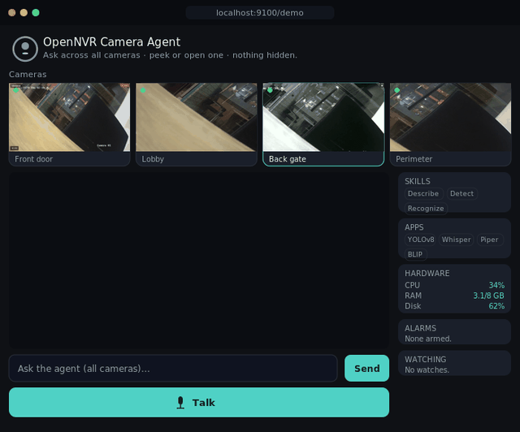

<div align="center">


# OpenNVR — open-source, self-hosted NVR with AI you control

### Cameras are everywhere. Almost none of them are yours.

**A self-hosted, offline-first network video recorder for ONVIF/RTSP IP cameras, with a pluggable AI platform. Runs on Docker — a laptop, a Raspberry Pi, or an air-gapped server.**

OpenNVR™ is the open, sovereign platform for recording your cameras and running AI on them — entirely on hardware you own, with **AI you choose and control**. No vendor cloud holds your footage or watches it for you. Air-gapped by default, an audit trail you can hand to a regulator. From a homelab doorbell that never phones home, to a laptop you spin it up on in a minute, to the air-gapped government site that legally cannot use anything else.

[](https://github.com/open-nvr/open-nvr/actions/workflows/ci.yml)
[](LICENSE)
[](https://www.python.org)
[](https://doi.org/10.5281/zenodo.17261761)

[Quickstart](#quickstart) · [Talk to your cameras](#talk-to-your-cameras) · [Build on it](#build-on-it) · [Read the paper](https://doi.org/10.5281/zenodo.17261761)

<a href="https://opennvr.org/camera-agent">
  
</a>

</div>

---

## Why this exists

In 2016, a botnet called Mirai conscripted hundreds of thousands of IP cameras into the largest DDoS attack the internet had ever seen. In 2021, an attacker compromised cloud credentials at Verkada and took live feeds from around 150,000 cameras across hospitals, schools, prisons, and factories. Federal advisories continue to land against major vendors — Hikvision, Dahua, Uniview, Edimax — whose firmware quietly powers critical infrastructure around the world.

The pattern keeps repeating because the architecture is wrong. Cameras are connected to vendor clouds. The vendor holds the keys. The vendor controls the AI. The vendor's breach is your breach. A decade after Mirai, the industry has not fixed itself.

And now the rules have changed. Under NDAA §889 and the 2025–26 FCC enforcement, U.S. federal agencies, contractors, and a widening set of regulated buyers can no longer use cameras from the dominant vendors — forcing a rip-and-replace cycle in environments where cloud surveillance was never an option to begin with: defence, critical infrastructure, healthcare, schools, and government. They need a recording and AI layer they can run entirely on their own terms. That layer didn't exist as open infrastructure. OpenNVR is the bet that it should.

OpenNVR is the bet that the alternative is open-source surveillance infrastructure built around four commitments: **cameras you connect, hardware you own, AI you choose and author, audit logs you can show to a regulator.**

The architecture is published — a peer-citable paper this year, 34 references, three-tier offline-first model, six categories of systemic IP-camera weakness it structurally eliminates ([DOI 10.5281/zenodo.17261761](https://doi.org/10.5281/zenodo.17261761)). This repo is the reference implementation.

## What makes it different

**It's secure by design.** Network isolation between the camera plane, the middleware gateway, and the analytics layer is the architecture, not a configuration toggle. Credentials are encrypted at rest with Fernet, RTSP travels over RTSPS to anything outside the host, and two independent default-deny gates — `DEPLOYMENT_MODE=offline` and `AI_SOVEREIGNTY=local_only` — keep cloud routes and AI egress returning HTTP 403 until an operator explicitly opens them. The systemic IP-camera weaknesses the paper documents — default credentials, hard-coded keys, unsigned firmware updates, exposed management interfaces, vendor-controlled cloud aggregation, opaque telemetry — are structurally eliminated rather than mitigated case by case. Threat model and control mapping in [`docs/SECURITY_ARCHITECTURE.md`](docs/SECURITY_ARCHITECTURE.md).

**It's auditable.** Every inference threads a correlation ID from the alert that fired, through the middleware that proxied it, to the model that made the call. Model weights are fingerprinted with sha256 and polled for drift. Cloud routes return HTTP 403 by default. The audit log answers *"why did this alert fire?"* without guesswork. Procurement-grade evidence in [`docs/COMPLIANCE.md`](docs/COMPLIANCE.md).

**Its AI layer is open.** Any model behind a REST or WebSocket endpoint becomes a first-class capability through the AI Adapter Contract — a published wire spec. Object detection, open-vocabulary detection, license-plate OCR, face recognition, scene captioning, multi-object tracking, ASR, TTS, LLM tool-calling all ship out of the box. The SDK to write your own is Apache-2.0 and runs around thirty lines of Python.

**You can talk to it — by voice or text.** The included camera-agent lets you *ask* your cameras questions. Run it **hands-free by voice** (a Pipecat loop with a named persona and animated avatar) or as a lighter **text chat** — same app, same tools, one flag apart, both on a plain CPU. The brain runs locally (Ollama) by default, or you **bring your own** any OpenAI-compatible model — your choice, your control. See [`examples/camera-agent/README.md`](examples/camera-agent/README.md).

**It runs on the hardware you already have.** If the machine it's on has a camera — a laptop webcam, a USB or Pi camera, the onboard sensor on a drone or robot — the agent can discover and use it with zero provisioning. Any device that can see a camera or a stream can run its own on-board sovereign agent.

**It's built for sovereignty.** For homelab users that means the doorbell that doesn't phone home. For defence, critical infrastructure, healthcare, and government deployments it means tactical AI that runs on your hardware under your control — models you've fine-tuned, models you can't share with a vendor, analytics whose detection logic itself is operationally sensitive. The procurement brief is in [`docs/GOVERNMENT_DEPLOYMENT.md`](docs/GOVERNMENT_DEPLOYMENT.md).

## How it compares

Frigate is the right call for a lot of homelabbers, and we say so — [the full, honest breakdown](docs/COMPARISONS.md) walks through Frigate, ZoneMinder, Shinobi, Viseron, and Verkada one by one. OpenNVR is solving a *different* problem: auditable AI surveillance with operator-controlled, sovereign AI. Where that difference shows up:

| | **OpenNVR** | **Frigate** | **ZoneMinder** | **Verkada** (cloud) |
|---|:---:|:---:|:---:|:---:|
| Self-hosted, runs air-gapped | ✅ | ✅ | ✅ | ❌ |
| AI detection out of the box | ✅ | ✅ | plugins | ✅ (vendor) |
| **Open adapter contract** — any model, any license, out-of-tree | ✅ | in-tree¹ | ❌ | ❌ |
| **Talk to your cameras** — local voice + text agent | ✅ | ❌ | ❌ | ❌ |
| **End-to-end audit chain** + model-fingerprint drift detection | ✅ | ❌ | ❌ | ❌ |
| **Default-deny sovereignty gates** (no cloud/AI egress until you allow it) | ✅ | partial | ❌ | ❌ |
| **§889 / covered-vendor self-check** built in | ✅ | ❌ | ❌ | ❌ |
| Peer-citable architecture paper | ✅ | ❌ | ❌ | ❌ |
| You control the AI (weights, egress, fine-tunes) | ✅ | ✅ | ✅ | ❌ |

<sub>¹ Frigate ships strong AI (face, LPR, CLIP search, GenAI descriptions) — the architectural difference is *how it's added*: Frigate's capabilities land in-tree under one license; OpenNVR ships a published wire contract + Apache-2.0 SDK so third parties publish adapters out-of-tree under **any** license, including proprietary or classified. Full nuance, and who should pick which: [`docs/COMPARISONS.md`](docs/COMPARISONS.md).</sub>

## Quickstart

**Clone it, run one command, answer a few on-screen prompts.** That's the whole install — no editing files, no copying `.env`, no separate secret step. Pre-built images on GHCR, no source build.

### 1. Clone

```bash
git clone https://github.com/open-nvr/open-nvr.git
cd open-nvr
```

### 2. Run the launcher

**Windows (PowerShell):**
```powershell
.\start.ps1
```

**Linux / macOS:**
```bash
./start.sh
```

That's the only command you run. It requires just [Docker](https://docs.docker.com/get-docker/) (Desktop on Windows/macOS, Engine + Compose v2 on Linux) to be installed and running.

### 3. Answer the on-screen prompts

On a fresh checkout the launcher opens an interactive installer. Every question shows a sensible default in `[brackets]` — **press Enter to accept it**, or type a value to change it. Nothing needs an account, an API key, or anything cloud; it all runs locally.

```
   ___                   _   ___     ______
  / _ \ _ __   ___ _ __ | \ | \ \   / /  _ \
 | | | | '_ \ / _ \ '_ \|  \| |\ \ / /| |_) |
 | |_| | |_) |  __/ | | | |\  | \ V / |  _ <
  \___/| .__/ \___|_| |_|_| \_|  \_/  |_| \_\

  OpenNVR interactive installer
  ✓ Detected Windows (Docker bridge mode)

  -- Basic settings -------------------------------------
  Administrator username [admin]:
  Administrator email [admin@opennvr.local]:
  Recordings folder on this machine [C:/opennvr/recordings]:

  -- Example app ----------------------------------------
  Set up an example app now? [y/N]: y
   3. camera-agent   [installable: docker-compose.camera-agent.yml]
   0. Core stack only
  Select an example [0]: 3
  Camera Agent mode: 1=voice, 2=chat [1]:
  Local LLM model (Ollama) [qwen2.5:1.5b]:
```

Prefer to just accept everything? Press Enter through every prompt and you get a working local stack. The installer then generates all secrets, downloads the images (and, if you picked the Camera Agent, a ~1 GB local model), builds, and starts everything.

> ⏳ **First run takes 8–15 minutes** depending on your network — it's downloading container images and the AI model. Later starts are much faster because everything is cached.

### 4. Open the URL and paste the token

When it finishes, the launcher prints the access URLs and a one-time setup token **as the very last thing** — copy the token into the browser:

```
  ✓ OpenNVR is running!
  Web UI (local) → http://localhost:8000  (login: admin)
  Web UI (HTTPS) → https://localhost/
  Web UI (LAN)   → https://<this-host-ip>/
  Camera Agent   → http://localhost:9100/demo   (only if you chose it)

  🔑 First-time setup token (one-time use — copy into the UI):
  ================================================================
   OpenNVR first-time setup token (one-time use)
  ----------------------------------------------------------------
    aXyZ_pasteThisIntoTheBrowser_4cFiRsT-tImE-sEtUp
  ----------------------------------------------------------------
  ================================================================
```

Then:

1. **Open the printed URL** on any device on your LAN.
2. **Accept the self-signed cert warning once** — *Advanced → Accept the risk and continue*. The cert lives in `./nginx-certs/` on the host and never leaves the machine.
3. **Paste the token, set an admin password, add a camera.** Detection overlays appear within ~30 seconds.

Live streams (WebRTC, HLS) and recording playback work from any LAN device.

### Running it again

Run `.\start.ps1` (or `./start.sh`) any time. If it's already set up, it asks whether to **start with your current config** or **reconfigure** (change settings / swap the example), then starts. To skip the question: `up` starts now, `reconfigure` re-runs the wizard, `token` re-prints the setup token.

> **Just want to try the AI?** Pick **camera-agent** in step 3, or see [Talk to your cameras](#talk-to-your-cameras).

> **Don't need object detection?** Set `DETECT_PIPELINE_ENABLED=false` in `.env` and restart — the always-on detection loop (and its CPU) switches off entirely, while recording, playback, the camera-agent, and any adapters you bring keep working. Made for setups running other kinds of AI (captioning/VQA, LPR, faces, your own [Adapter Contract](docs/AI_ADAPTER_CONTRACT.md) models) that don't want a detector running underneath.

### Common follow-ups

Commands below use `./start.sh`; on Windows use `.\start.ps1` with the same word.

| Situation | Command |
|---|---|
| Re-print the setup token | `./start.sh token` |
| Change settings or swap the example | `./start.sh reconfigure` |
| Start without the reconfigure prompt | `./start.sh up` |
| Your LAN IP changed (DHCP, moved boxes) | `./start.sh refresh-certs` *(Linux/macOS)* |
| Stop everything | `./start.sh down` |
| Tail live logs | `./start.sh logs` |
| Check container status | `./start.sh status` |
| Pick up new GHCR images after an upgrade | `docker compose pull && ./start.sh up` |

### Advanced setup

Want to skip the interactive wizard — pin specific secret values, run unattended on a CI box, deploy from configuration management?

```bash
git clone https://github.com/open-nvr/open-nvr.git
cd open-nvr
cp .env.example .env
./scripts/generate-secrets.sh --write    # or write your own values
./start.sh up                            # still gets pre-flight + posture + token
```

Skipping `./start.sh up` and using bare `docker compose up -d` works too, but you'll lose: NIC topology auto-detect, the security posture banner, the one-time setup token surfacing. Grep the logs manually if you go that route.

**Need more detail?** [`DOCKER_QUICKSTART.md`](DOCKER_QUICKSTART.md) covers retention, production hardening, profile options, and a [compose-file reference](DOCKER_QUICKSTART.md#compose-file-reference) explaining every compose file and when each applies.

## OpenNVR Cam — your phone as a test camera

**[OpenNVR Cam](https://play.google.com/store/apps/details?id=org.opennvr.cam)** (Android, on Google Play) turns your mobile into an IP camera with **ONVIF support** — the quickest way to test OpenNVR without any camera hardware: install the app, and OpenNVR discovers and streams it like any real ONVIF camera.

## Talk to your cameras

The camera-agent lets you *ask* your cameras questions — all on your hardware. **One command, from the repo root:**

```bash
examples/camera-agent/quickstart.sh          # voice: click Start and speak
examples/camera-agent/quickstart.sh --chat   # chat: type and read (lighter — no mic/speaker)
examples/camera-agent/quickstart.sh --down   # stop
```

Then open <http://localhost:9100/demo>. **No camera?** Click **"Use this machine's camera"** to run against your laptop webcam (or any USB/Pi/onboard device) with zero provisioning.

First boot pulls the small LLM (default `qwen2.5:1.5b`) and warms the adapters — give it a minute. A few knobs:

- **Low-RAM box** — `OLLAMA_MODEL=qwen2.5:0.5b examples/camera-agent/quickstart.sh`
- **Mac / Windows: run the LLM on the host** — Docker's VM has no GPU access on
  these platforms, so the bundled LLM container answers on plain CPU (minutes
  per turn on an M1). Set `OLLAMA_EXTERNAL_URL=http://host.docker.internal:11434`
  in `.env` (the installer offers this — and can install Ollama and pull the
  model for you): the agent uses host Ollama on the real GPU (Metal on Apple
  Silicon, seconds per turn) and the 3.2 GB ollama image is skipped entirely.
  Pair with `CAPTION_ADAPTER=ollamavlm` to run scene descriptions on the same
  host runtime.
- **Cloud / bring-your-own brain** — point it at any OpenAI-compatible endpoint; see [`config.cloud.yml`](examples/camera-agent/config.cloud.yml)
- **Drive Compose yourself** — `docker compose -f docker-compose.yml -f docker-compose.camera-agent.yml --profile camera-agent up -d` (or `--profile camera-agent-chat`)

Full details — model picks, hardware notes, how it works — in [`examples/camera-agent/README.md`](examples/camera-agent/README.md).

**What you can ask:**

| You say | What happens |
|---|---|
| *"What's at the back gate?"* | LLM calls BLIP for a scene caption of the live frame |
| *"Is anyone in the kitchen?"* | LLM calls YOLOv8 on the current frame |
| *"Did anyone walk past in the last ten minutes?"* | LLM queries the inference event ring on NATS |
| *"Who was at the door this morning?"* | LLM calls InsightFace against your enrolled face DB |
| *"Did a red truck come by the dock earlier?"* | LLM searches the recorded-footage index (when a [`footage-search`](examples/footage-search) index is configured) |

Under the hood: a local LLM (Ollama) doing OpenAI-style tool-calling over your live frames — or a cloud brain you bring. The LLM runtime is a dial, not a dependency: the bundled Ollama container (Linux default), an Ollama on the machine hosting Docker (`OLLAMA_EXTERNAL_URL` — the macOS/Windows default, where the host's GPU does the work), or any OpenAI-compatible endpoint. The default is the full hands-free voice loop (Pipecat · Silero VAD · Whisper STT · Piper TTS); `--chat` is the same agent, lighter, typed instead of spoken. No cloud and no API keys unless *you* choose a cloud model.

This is the first OpenNVR example where the cameras have agency, not just data.

## Build on it

The AI Adapter Contract is what makes OpenNVR a platform, not a product. Any model behind a REST or WebSocket endpoint can become a first-class capability:

```python
from opennvr_adapter_sdk import (
    AdapterApp, AdapterService, BodyShape, BODY_BYTES_KEY,
    HardwareEvaluationResponse, HardwareVerdict,
    InferResponse, ModelInfo,
)

class MyDetector(AdapterService):
    def load(self):
        # eagerly load your weights
        ...

    def is_ready(self) -> bool:
        return True

    def fingerprint(self) -> str | None:
        return "sha256:..."

    def model_info(self) -> ModelInfo:
        return ModelInfo(
            name="my-model", version="1.0.0",
            framework="onnx", fingerprint=self.fingerprint(),
        )

    def hardware_evaluation(self) -> HardwareEvaluationResponse:
        return HardwareEvaluationResponse(verdict=HardwareVerdict.OK, ...)

    def infer(self, payload) -> InferResponse:
        frame_bytes = payload[BODY_BYTES_KEY]
        # ... your model ...
        return InferResponse(result={"detections": [...]})

app = AdapterApp(
    service=MyDetector(),
    name="my-detector", version="1.0.0", vendor="me", license="MIT",
    tasks_advertised=["object_detection"],
    body_shape=BodyShape.IMAGE,
).fastapi_app
```

`uvicorn my_module:app --port 9100`, register the URL with KAI-C, and your adapter is online — hot-swappable, audit-chained, fingerprint-tracked. The SDK is Apache-2.0 so your adapter can ship under any compatible license, including proprietary or classified.

What the contract makes straightforward to build (some already ship as examples):

- **Natural-language footage search** — "find clips with a red truck at the dock yesterday" — ships today as the [`footage-search`](examples/footage-search) example, using scene captions plus the open-vocabulary [`vlm`](https://github.com/open-nvr/ai-adapter/tree/main/adapters/vlm) adapter.
- **Tracker-stable alert deduplication** for warehouses ("don't fire 'person detected' sixty times for the same forklift driver walking past").
- **Pose-based fall detection** for memory-care facilities (needs a pose adapter; on the roadmap).
- **Site-specific PPE compliance** for construction with the false-positive threshold tuned to what the insurer will accept.
- **Domain-specific NVRs** — dispensary compliance, school weapons detection, port cargo logging — built by forking an example and replacing the predicate.

Eight reference adapters and a one-command scaffold to start your own live in the sibling [ai-adapter](https://github.com/open-nvr/ai-adapter) repo. Full authoring walkthrough in the [SDK README](https://github.com/open-nvr/ai-adapter/blob/main/opennvr_adapter_sdk/README.md).

## Applications ship on top of it

Adapters are *capabilities*; applications are *solutions*. Each example below is a working application — adapter(s) + a pipeline + alert rules — that you install, point at a camera, and adapt. Replace the predicate (the zone check, the dwell timer, the plate watchlist) with your domain logic and you have a purpose-built NVR. This is the platform's direction: a catalog of installable applications, not a fixed feature set.

| Application | What you'll build | Difficulty |
|---|---|---|
| [`intrusion-detection`](examples/intrusion-detection) | People in restricted zones during restricted hours | beginner |
| [`loitering-detection`](examples/loitering-detection) | Dwell-time state machine on a NATS inference stream | intermediate |
| [`occupancy-counting`](examples/occupancy-counting) | Zone occupancy with edge-triggered over/under alerts | intermediate |
| [`line-crossing`](examples/line-crossing) | Directional tripwire / entry-exit counting (tracked) | intermediate |
| [`abandoned-object`](examples/abandoned-object) | Unattended-item detection with owner-proximity suppression | advanced |
| [`footage-search`](examples/footage-search) | Natural-language search over recorded inference ("red truck yesterday") | advanced |
| [`license-plate-recognition`](examples/license-plate-recognition) | YOLOv8 + fast-plate-ocr chain with allowlists | intermediate |
| [`smart-doorbell`](examples/smart-doorbell) | InsightFace recognition with REST enrollment | intermediate |
| [`package-delivery`](examples/package-delivery) | Per-track state machine for arrival, linger, pickup | intermediate |
| [`camera-agent`](examples/camera-agent) | Ask your cameras questions — ~1–2 GB text mode on a laptop, up to full hands-free voice | beginner→advanced |
| [`home-assistant-relay`](examples/home-assistant-relay) | Bridge alerts into Home Assistant via MQTT discovery | intermediate |

Eleven of the thirteen shipped examples are listed above; [`inference-listener`](examples/inference-listener) and [`alerts-subscriber`](examples/alerts-subscriber) round out the set as minimal subscriber templates. Each application is a copy-as-template starting point. Gallery walkthrough and the "drives inference vs subscribes to events" axis-grid in [`examples/README.md`](examples/README.md). The roadmap for the application catalog — audio-event detection, tamper-evident incident export, and the vertical safety/security packs — is in [`docs/ROADMAP.md`](docs/ROADMAP.md).

**Build an app.** Don't want to fork an example? A generator scaffolds a minimal, runnable app and you fill in **one method** — the rule. Start with **[Your first OpenNVR detector in 15 minutes](docs/FIRST_DETECTOR.md)**: `python3 scripts/create_opennvr_app.py my-app` → edit `on_detections` → `uv run pytest` green → run it against the stack → publish to the App Store.

## Community

Bugs go in [Issues](https://github.com/open-nvr/open-nvr/issues), design questions in [Discussions](https://github.com/open-nvr/open-nvr/discussions), security reports via [private GHSA advisory](https://github.com/open-nvr/open-nvr/security/advisories/new). PR flow is in [`CONTRIBUTING.md`](CONTRIBUTING.md); the [roadmap](docs/ROADMAP.md) names where help is wanted next.

Commercial deployments — deployment assistance, NDA adapter authoring, compliance evidence packs, SLA-backed support — [contact@opennvr.org](mailto:contact@opennvr.org).

## Documentation

**Getting started** — [Docker quickstart](DOCKER_QUICKSTART.md) · [User manual](USER_MANUAL.md) · [Local dev setup](docs/LOCAL_SETUP.md) · [Use cases by industry](docs/USE_CASES.md) · [Comparisons](docs/COMPARISONS.md)

**Architecture & security** — [Security architecture](docs/SECURITY_ARCHITECTURE.md) · [Compliance mapping](docs/COMPLIANCE.md) · [Government deployment brief](docs/GOVERNMENT_DEPLOYMENT.md) · [AI Adapter Contract](docs/AI_ADAPTER_CONTRACT.md) · [Edge autonomy & robotics](docs/EDGE_AUTONOMY.md)

**Project** — [Roadmap](docs/ROADMAP.md) · [Support](docs/SUPPORT.md) · [Changelog](CHANGELOG.md) · [Contributing](CONTRIBUTING.md)

## License, commercial use & trademark

OpenNVR is **dual-licensed** — the Qt/Linphone model, on a stronger base:

- **AGPL-3.0-or-later** for the platform core: free forever, on any
  hardware (Jetson, Pi, your own servers), for anyone who honors the
  AGPL — including its network clause.
- **Apache-2.0** for the developer edges: the
  [app SDK](sdk/opennvr-app-sdk) and the
  [adapter SDK](https://github.com/open-nvr/ai-adapter/tree/main/opennvr_adapter_sdk),
  so apps and adapters you write can ship under any license —
  including proprietary or classified where that matters.
- The **OpenNVR Commercial License** for what the AGPL doesn't allow:
  selling hardware with OpenNVR pre-installed under your brand,
  embedding it in proprietary software, hosted offerings without
  source disclosure, or white-labeling. Commercial builds carry the
  "Powered by OpenNVR" mark. Full policy, decision matrix and FAQ:
  [`docs/LICENSING.md`](docs/LICENSING.md).

Contributions to the AGPL core require a [CLA](docs/CLA.md) (you keep
your copyright; the project keeps the right to dual-license); SDK
contributions need only a DCO sign-off.

"OpenNVR" and the OpenNVR logo are trademarks of the project. You may use them to refer to the project and to describe software as "compatible with OpenNVR," but redistribution of modified versions under the OpenNVR name requires permission. See [`TRADEMARK.md`](TRADEMARK.md).

---

<div align="center">

**OpenNVR — cameras you connect, hardware you own, AI you choose and author, audit you can show.**

[⭐ Star on GitHub](https://github.com/open-nvr/open-nvr) · [📄 Read the paper](https://doi.org/10.5281/zenodo.17261761) · [⚡ Quickstart](#quickstart)

</div>
